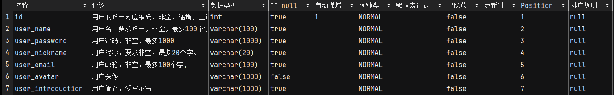

# OIDC_BingYan

>2024冰岩作坊后端实习题OIDC。

**注：每天的记录都是按照实现顺序一步步来的，也就是说有可能出现对于一个任务的框架建立和具体实现在两个地方的情况。**

在具体的代码里我新学会的东西都进行了详细的注释。

## 24.3.23任务梳理

### 新建文件夹（）

创建一个springboot项目，名称为OIDC。

采用版本为JDK1.8，Java8，SpringBoot2.6.13。

### 引入依赖

1. **Spring Boot Starter JDBC**：
   - 用于简化 JDBC（Java Database Connectivity）操作，提供快速集成 JDBC 的依赖管理。
   - `<artifactId>spring-boot-starter-jdbc</artifactId>`：包括了 Spring JDBC 的自动配置支持。
2. **Project Lombok**：
   - 用于简化 Java 实体类的编写，提供了简洁的注解来自动生成常见的方法，如 getters, setters, toString 等。
   - `<artifactId>lombok</artifactId>`：此依赖在编译时自动处理注解，生成相应的方法。
3. **MySQL Connector/J**：
   - MySQL 的 JDBC 驱动，用于连接 MySQL 数据库。
   - `<artifactId>mysql-connector-j</artifactId>`：使 Java 应用能够通过 JDBC 访问 MySQL 数据库。
4. **MyBatis-Plus Boot Starter**：
   - 基于 MyBatis 的增强工具，提供更多便捷的操作，减少 CRUD 相关代码。
   - `<artifactId>mybatis-plus-boot-starter</artifactId>`：集成 MyBatis Plus 到 Spring Boot 项目中，简化配置。
5. **MyBatis-Plus Generator**：
   - 用于自动生成 MyBatis 的映射文件（Mapper）、接口以及对应实体类的代码生成器。
   - `<artifactId>mybatis-plus-generator</artifactId>`：帮助开发者快速生成数据访问层代码。
6. **Spring Boot Starter Security**：
   - 提供了 Spring Security 的自动配置功能，用于增强 Web 应用的安全性。
   - `<artifactId>spring-boot-starter-security</artifactId>`：集成 Spring Security，提供认证和授权等安全功能。
7. **JJWT (Java JWT)**：
   - 用于创建和解析 JSON Web Tokens (JWT) 的库，广泛用于现代 Web 应用的安全认证。
   - `<artifactId>jjwt-api</artifactId>`、`<artifactId>jjwt-impl</artifactId>` 和 `<artifactId>jjwt-jackson</artifactId>`：这三个依赖提供了 JWT 的创建、解析以及与 Jackson 库的集成。
8. **JetBrains Annotations**：
   - 提供了一套 Java 注解，用于代码分析和工具支持，有助于提高代码的可读性和减少错误。
   - `<artifactId>annotations</artifactId>`：用于标记代码，如可空性注解等，以增强 IDE 的代码检查能力。

### 配置数据库与数据源

数据库采用MySql。

用户表内容包括：

### 实现基本的用户注册登录获取信息代码框架

1. pojo
   1. User
2. Mapper
   1. UserMapper
3. Service
   1. User
      1. account
         1. Info
         2. Login
         3. Register
4. Controller
   1. User
      1. account
         1. Info
         2. Login
         3. Register

### 引入Spring Security

经过重写UserDetailsService和UserDetails，实现用户认证和授权。

配置Security实现加密密码。PasswordEncoder采用BCryptPasswordEncoder。

#### 实现JWT

重写WebSecurityConfigurerAdapter类来自定义spring security配置。

禁用CSRF保护，我们有token验证

设置session为无状态，jwt不需要这个

允许跨域预检请求

开放几个公开接口来注册登录

##### 实现JWT工具

1. **生成密钥** (`generalKey` 方法)：
   - 将一个预定义的字符串（JWT_KEY）通过 Base64 解码为字节数组。
   - 使用这个字节数组创建一个 `SecretKey` 对象，用于 JWT 的签名和验证。
2. **生成 JWT** (`createJWT` 方法)：
   - 调用 `getUUID` 方法生成一个唯一标识符（UUID）。
   - 调用 `getJwtBuilder` 方法创建一个 `JwtBuilder` 对象，设置 JWT 的主题（subject）、发行者（issuer）、签发时间（issuedAt）、过期时间（expiration）等。
   - 使用生成的 `SecretKey` 对 JWT 进行签名。
   - 调用 `compact` 方法将 JWT 对象压缩成一个字符串，这个字符串就是最终的 JWT。
3. **解析 JWT** (`parseJWT` 方法)：
   - 调用 `generalKey` 方法生成 `SecretKey` 对象。
   - 使用 `Jwts.parser().verifyWith(secretKey)` 来验证 JWT 的签名是否有效。
   - 解析 JWT 字符串，获取 JWT 的负载（payload），这里主要是 `Claims` 对象，其中包含了 JWT 的信息，如主题、签发者等。

##### 实现JWT拦截器

提取 JWT：从 HTTP 请求的 Authorization 头部提取 JWT。如果请求头不存在或不是以 "Bearer " 开头，则直接放行（即不进行 JWT 验证）。

JWT 解析：使用 JwtTool.parseJWT(token) 方法尝试解析 JWT。如果解析失败（比如，JWT 无效或过期），抛出异常。

用户验证：通过 JWT 中的主题查询用户信息。如果查询不到用户，表示用户不存在或未登录，抛出异常。

认证信息设置：使用查询到的用户信息创建 UsernamePasswordAuthenticationToken，并将其设置到 SecurityContextHolder 中。这样，后续的处理流程就可以认为该请求已经通过身份验证。

请求放行。

### 实现登录

采用AuthenticationManager处理认证。

用UsernamePasswordAuthenticationToken封装用户名和密码。

用AuthenticationManager.authenticate(authenticationToken)进行认证，认证失败自己报错。

认证成功后，生成token，并返回给前端。

### 实现注册

注册需要7个值：

1. 用户名
2. 密码
3. 确认密码
4. 邮箱
5. 昵称
6. 头像
7. 简介

头像为头像简介，目前用的是手动上传的图床图像，后续会编写一个上传头像的接口。

如果上传的7个值满足一定要求就注册然后插入就完了。

### 出现bug，开修！

什么！为什么我的MySql不能正常的让我的id自增！？！？

明明已经设置了id自增，唯一，且为主键。

代码逻辑也没问题。。。

尝试直接在cmd里插入一个值，居然是正常的！！

说明问题出现在mybatis-plus的配置上。

可能也跟spring boot的版本有关，之前写的项目就没这样的错误！

没事我直接手动自增就好了。。。。笨但是管用的办法。。。。

### 总结

今天新建了文件夹，配置了各项依赖，调整了数据库，大概写了一下用户的登录，注册模块，修复了bug。。。嗯，明天开始正式的OIDC。。。。

## 24.3.24任务梳理

>说是24号，其实是23号晚上，今晚要熬夜了嗯。。。

### 手敲USER

把之前直接注入的User类改写为手动new的User类。

### 头像上传（调试）

使用图床API上传图片，仍在调试中

### 邮箱发送（调试）

利用两个属性来判断一个用户是否激活来实现发送邮件注册，仍在调试中。
